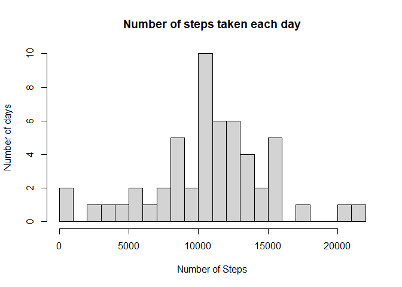
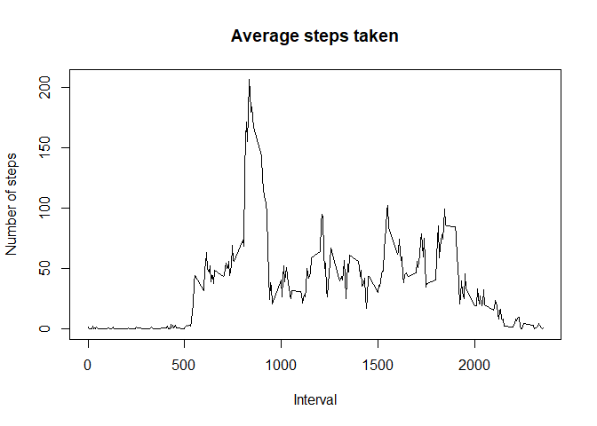
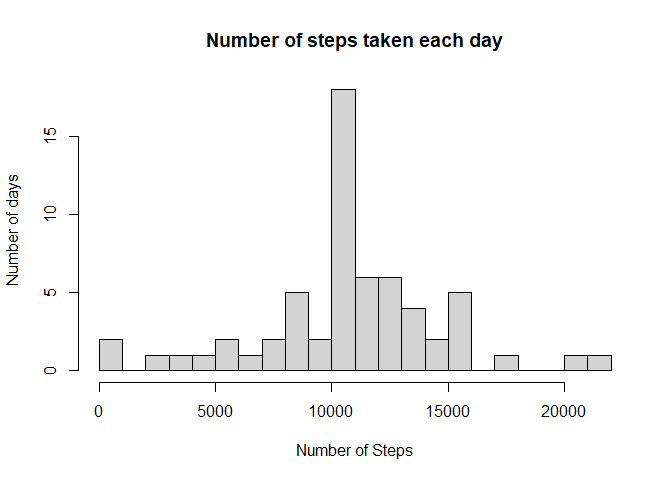
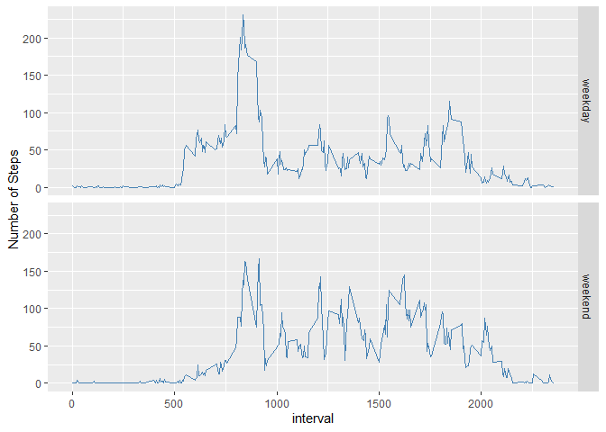

## Loading and preprocessing the data

Data is read using read.csv and date column is converted to type date:


```r
data <- read.csv("activity.csv")
data[[2]] <- as.Date(data[[2]], format = "%m/%d/%Y") 
head(data)
```

```
##   steps       date interval
## 1    NA 2012-10-01        0
## 2    NA 2012-10-01        5
## 3    NA 2012-10-01       10
## 4    NA 2012-10-01       15
## 5    NA 2012-10-01       20
## 6    NA 2012-10-01       25
```

The variables included in this dataset are:

1. **steps**: Number of steps taking in a 5-minute interval (missing values are coded as NA ) 
2. **date**: The date on which the measurement was taken in YYYY-MM-DD format 
3. **interval**: Identifier for the 5-minute interval in which measurement was taken

## What is mean total number of steps taken per day?

Firstly, the data is grouped by day. Then the histogram is created.


```r
steps <- aggregate(x=data$steps, by=list(data$date), FUN=sum, na.rm=T)
steps <- steps[!steps$x==0,]

hist(steps$x,breaks = 25, main = "Number of steps taken each day",
     xlab = "Number of Steps", ylab = "Number of days")
```

<!-- -->

The mean and median steps per day respectively are:


```r
mean(steps$x)
```

```
## [1] 10766.19
```

```r
median(steps$x)
```

```
## [1] 10765
```


## What is the average daily activity pattern?

The below plot addresses the following items:

1.  Make a time series plot (i.e. type = "l") of the 5-minute interval (x-axis) and the average number of steps taken, averaged across all days (y-axis)


```r
steps <- aggregate(x=data$steps,by=list(data$interval),FUN=mean,na.rm = T)

plot(steps$Group.1,steps$x,main = "Average steps taken",xlab = "Interval"
     ,ylab = "Number of steps",type = "l")
```

<!-- -->

2.  Which 5-minute interval, on average across all the days in the dataset, contains the maximum number of steps?


```r
steps[steps$x == max(steps$x),1]
```

```
## [1] 835
```


## Imputing missing values

Calculate & Report The Number of Missing Values


```r
sum(!complete.cases(data))
```

```
## [1] 2304
```
Imputing the values by taking the mean of steps by interval and rounding them to the nearest integer.


```r
steps$x = round(steps$x)

impute <- function(x){
  if(is.na(x[1])){
    x[1] <- steps[steps$Group.1 == as.numeric(x[3]),2]
  }
  x[1]
}
data2<-data
data2$steps <- as.numeric(apply(data,1,impute))
head(data2)
```

```
##   steps       date interval
## 1     2 2012-10-01        0
## 2     0 2012-10-01        5
## 3     0 2012-10-01       10
## 4     0 2012-10-01       15
## 5     0 2012-10-01       20
## 6     2 2012-10-01       25
```

New histogram after imputing values:


```r
steps <- aggregate(x=data2$steps, by=list(data2$date), FUN=sum, na.rm=T)

hist(steps$x,breaks = 25, main = "Number of steps taken each day",
     xlab = "Number of Steps", ylab = "Number of days")
```

<!-- -->

Mean and Median respectively:


```r
mean(steps$x)
```

```
## [1] 10765.64
```

```r
median(steps$x)
```

```
## [1] 10762
```

## Are there differences in activity patterns between weekdays and weekends?

Create a new factor variable in the dataset with two levels – “weekday” and “weekend” indicating whether a given date is a weekday or weekend day.


```r
type <- weekdays(data2$date)
type[type %in% c("Sunday","Saturday")] <- "weekend"
type[!type=="weekend"] <- "weekday"
type <- as.factor(type)
data2$type <- type
head(data2)
```

```
##   steps       date interval    type
## 1     2 2012-10-01        0 weekday
## 2     0 2012-10-01        5 weekday
## 3     0 2012-10-01       10 weekday
## 4     0 2012-10-01       15 weekday
## 5     0 2012-10-01       20 weekday
## 6     2 2012-10-01       25 weekday
```

Panel plot for average number of steps divided by weekday and weekend:


```r
steps <- aggregate(steps~interval+type,data2,FUN=mean)

library(ggplot2)

print(ggplot(steps, aes(x=interval,y=steps))+geom_line(color = "steelblue")+
        facet_grid(type~.)+labs(y = "Number of Steps"))
```

<!-- -->
